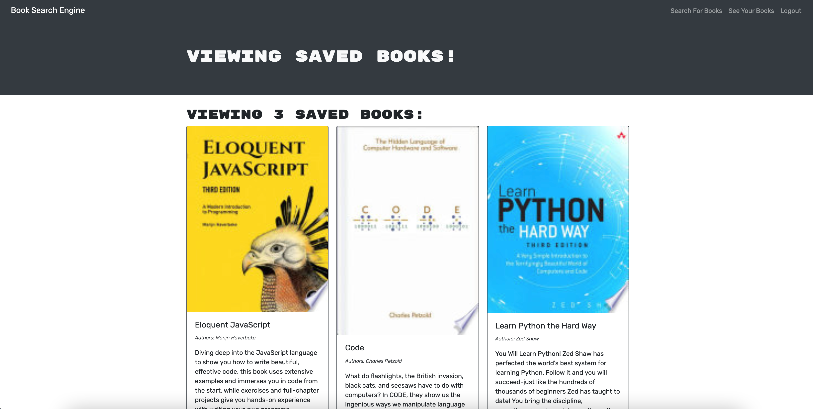

# Book Search Engine

## Description 
This full stack javascript MERN web application refactored a RESTful API search engine. This is a MERN stack application using (M) MongoDB, (E) Express.js, (R) React, and (N) Node.js. 

The refactored application uses Node.js and Concurrently to manage dependencies and run both the server side and client side of the application. The back end uses GraphQL, MongoDB,Express, and Apollo to connect to the front end, which uses the Google Books API and React, with bootstrap for styling.

This application is deployed on [Heroku](https://thawing-springs-93612.herokuapp.com/).

## Table of Contents
* [Installation](#installation)
* [Preview](#Preview)
* [User Story](#user)
* [License](#license)
* [Contributing](#contributing)
* [Tests](#tests)
* [Questions](#questions)

## Installation 
 Create a local clone of the github repository on your workstation by entering the following command in your Command Line Interface (CLI -- such as Terminal or Bash):
 - git clone git@github.com:hlry/book-search-engine.git

Install dependencies
 Run `npm i` at the root level of the application to install dependencies.
 For development or testing purposes, navigate into the client and server directories ("cd client" "cd .." "cd server" "cd .."). There are gitignore files in the root, in the server, and in the client to ensure that the node modules are not wasting space getting synced to GitHub. Make sure you are in the root when you push to your own GitHub, if you are doing so.

 Install MongoDB on your local computer. If you are developing this application for personal or educational purposes, you may be eligible for a gratis personal MongoAtlas instance (please refer to MongoDB's terms on its site).

To run the client and server at the same time, thanks to Concurrently.js you may simply enter the command `npm run start` from the root.

Root dependencies:
- if-env
- concurrently (dev dependency)

Client-side dependencies:
- apollo/react-hooks
- apollo-boost
- bootstrap
- express
- graphql
- graphql-tag
- jwt-decode
- react
- react-bootstrap
- react-dom
- react-router-dom
- react-scripts

Server-side dependencies:
- apollo-server-express
- bcrypt
- express
- graphql
- jsonwebtoken
- mongoose
- nodemon (dev dependency)

## Preview
Saved Book Page

## User
User Story:
AS AN avid reader
I WANT to search for new books to read
SO THAT I can keep a list of books to purchase

GIVEN a book search engine
WHEN I load the search engine
THEN I am presented with a menu with the options Search for Books and Login/Signup and an input field to search for books and a submit button
WHEN I click on the Search for Books menu option
THEN I am presented with an input field to search for books and a submit button
WHEN I am not logged in and enter a search term in the input field and click the submit button
THEN I am presented with several search results, each featuring a book’s title, author, description, image, and a link to that book on the Google Books site
WHEN I click on the Login/Signup menu option
THEN a modal appears on the screen with a toggle between the option to log in or sign up
WHEN the toggle is set to Signup
THEN I am presented with three inputs for a username, an email address, and a password, and a signup button
WHEN the toggle is set to Login
THEN I am presented with two inputs for an email address and a password and login button
WHEN I enter a valid email address and create a password and click on the signup button
THEN my user account is created and I am logged in to the site
WHEN I enter my account’s email address and password and click on the login button
THEN I the modal closes and I am logged in to the site
WHEN I am logged in to the site
THEN the menu options change to Search for Books, an option to see my saved books, and Logout
WHEN I am logged in and enter a search term in the input field and click the submit button
THEN I am presented with several search results, each featuring a book’s title, author, description, image, and a link to that book on the Google Books site and a button to save a book to my account
WHEN I click on the Save button on a book
THEN that book’s information is saved to my account
WHEN I click on the option to see my saved books
THEN I am presented with all of the books I have saved to my account, each featuring the book’s title, author, description, image, and a link to that book on the Google Books site and a button to remove a book from my account
WHEN I click on the Remove button on a book
THEN that book is deleted from my saved books list
WHEN I click on the Logout button
THEN I am logged out of the site and presented with a menu with the options Search for Books and Login/Signup and an input field to search for books and a submit button 

## License 
This project is license under the ISC license.

## Contributing 
Made by HLRY. This project is not currently accepting contributions.

## Tests
There are no tests for this application. 

## Questions
For any questions about the project/repository please contact me on GitHub @ [HLRY](https://github.com/hlry) 